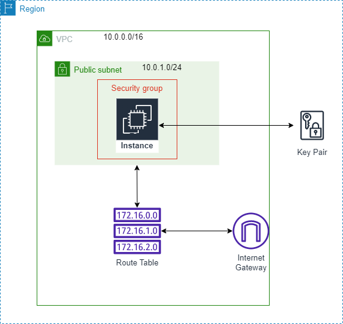

# Quick EC2 instance

This Terraform configuration spawns an EC2 instance on AWS very quickly. It takes care of creating all necessary resources for an EC2 instance to work (e.g. VPC, Route Table, Key Pair, etc). This project is not meant for production environmetns. The main use-case it solves is when you need a quick VM for personal experiments to be created.

## Instructions

### Prerequisites
1. [Install Tarreform](https://learn.hashicorp.com/tutorials/terraform/install-cli)
2. [Install AWS CLI](https://docs.aws.amazon.com/cli/latest/userguide/getting-started-install.html)
3. [Configure AWS CLI profile](https://docs.aws.amazon.com/cli/latest/userguide/cli-configure-quickstart.html)
4. Generate SSH private and public keys (run `ssh-keygen -t rsa -b 4096`)

### Usage
The only required input to the Terraform configuration is the path to the public SSH key file. So it can create a KeyPair resource and attach it to the EC2 instance. For example, assuming that your public key is in file `aws_key.pub`:

```bash
terraform apply -var="public_ssh_key_path=aws_key.pub"
```

By default the configuration creates a `t2.micro` Amazon Linux 2 instance in `eu-west-1` region (Dublin). But you can override the default values. For example, the following creates a `t3.medium` Ubuntu VM in `us-east-1`.

```bash
terraform apply -var="public_ssh_key_path=aws_key.pub" -var="instance_type=t3.medium" -var="ami=ami-04505e74c0741db8d" -var="region=us-east-1"
```

The Terraform configuration uses the AWS credentials found in the `default` profile. You can override the profile via input parameters:

```bash
terraform apply -var="public_ssh_key_path=aws_key.pub" -var="profile=profile-2"
```

## Reference Topology

<p align="center">
  
</p>

## License 
This project is licensed under the MIT License. Please see the LICENSE file for details.